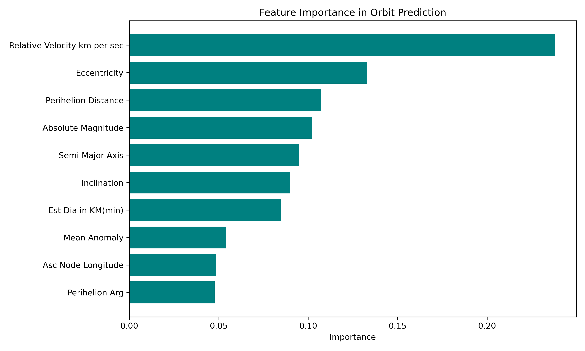
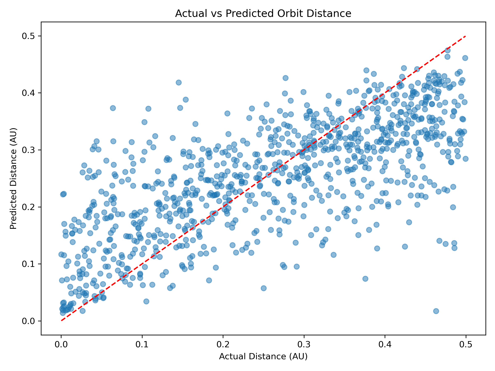
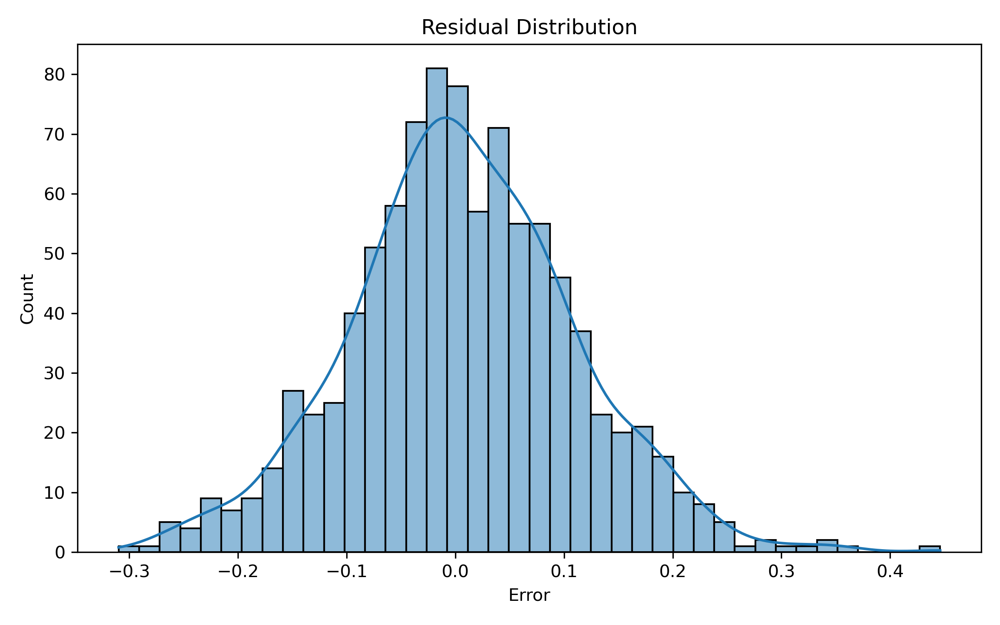
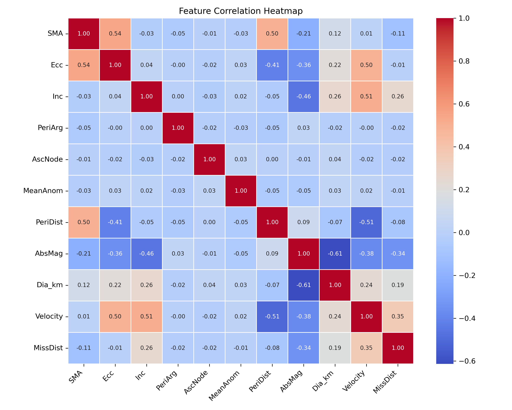

# Asteroid Orbit Distance Prediction

## **About this Project**

This project explores how **machine learning** can be used to predict the **miss distance of near-Earth asteroids** using their orbital and physical parameters.

I worked with a real **NASA asteroid dataset** and built a regression model to estimate how close an asteroid comes to Earth. This project combines **astrophysics + data science**, focusing on both prediction and understanding the relationships between orbital features.

---

## **What I Did**

* Cleaned and preprocessed real-world NASA data
* Selected important orbital features such as **semi-major axis, eccentricity, inclination**
* Applied **scaling and log transformation**
* Trained a **Random Forest Regressor**
* Evaluated model performance using regression metrics
* Visualized results using plots

---

## **Model Performance**

* **MAE:** 0.0808 AU
* **MSE:** 0.0109
* **R² Score:** 0.4957

The model explains around **50% of the variation** in asteroid miss distance.
This indicates that while the model captures important trends, asteroid motion is influenced by complex physical factors beyond the available features.

---

##**Visual Outputs**

### 🔹 **Feature Importance**

Shows which orbital parameters influence predictions the most.

---

### 🔹 **Actual vs Predicted**

Compares predicted values with actual observations.

---

### 🔹 **Residual Distribution**

Displays how prediction errors are distributed.

---

### 🔹 **Correlation Heatmap**

Shows relationships between different orbital features.

---

## **Tools & Technologies**

* **Python**
* **Pandas, NumPy**
* **Scikit-learn**
* **Matplotlib, Seaborn**

---

## **Key Takeaways**

* Orbital parameters like **semi-major axis and velocity** strongly influence predictions
* Machine learning captures trends but cannot fully model complex orbital physics
* Feature selection and data quality significantly impact performance

---

##  **Future Improvements**

* Use advanced models like **Neural Networks**
* Add more physics-based features
* Extend to real-time predictions using **NASA APIs**

---

## **About Me**

I am an MSc Astrophysics student interested in **astrophysics, data analysis, and machine learning**.
I enjoy combining physics concepts with computational techniques to explore real-world space data.
I developed this code for my semester project in Astronomy subject.

---

## **Final Note**

This project reflects an effort to combine **astrophysics with machine learning**, showing how data-driven approaches can complement traditional methods in understanding celestial motion.
